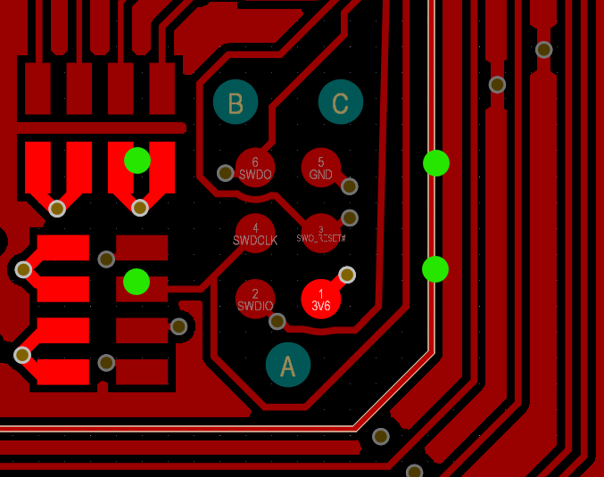

# First board is a prototype

## Summary 
The first prototype should not be striving to be final, it should just diminish design uncertainties as much as it can. Design it as a prototype.

## Driving Event
The first board of Bart was overall in good shape, but it lacked a few prototype qualities. The power lines were not separable (worrying over power line impedance), and the Tag connect footprint was lacking the mounting holes. (worrying over board space)

*The Tag connect has mounting holes that enable the connector to clip in. Thsi footprint is actually for once in a while programming.*

## Reasons
Well, a designer has a way of doing their things. Although it is a good trait overall, 
the first board is more of an experiment than a product. 

In the set of uncertainties that a design has in its inception, there are ones that we are aware
of their presence, and there are ones that only become evident when the design is physically realised. 
 
When a design is meant to be a prototype, we capture all of the first set, and if we are lucky, a portion 
of the second set. 

> This, in my opinion, better than the other way around. Although it is nice to have a 
> mean revision count around 2, in most worthwhile projects that number will exceed 2.
> 
> MA

## Results

A few days lost. Had to learn Fusion to design a holder. Still trying to find the where the current sinks. 

## Mitigation

- Name prototypes as prototypes. Make that explicit and people will look at it as one.
- Write down all the 'experiments' in the schematic and in the issue management system. 
- Order prototype boards with a distinguishing color.
- A lot of probes, jumpers.

