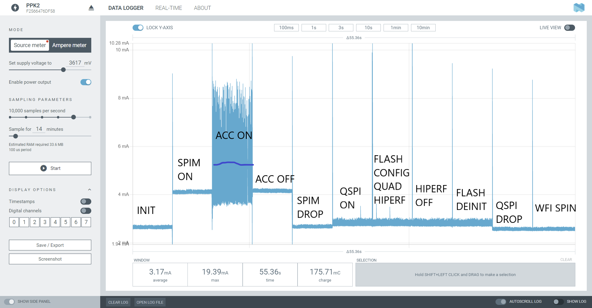

# Search for low power goes through Erratas

## Summary 
It is a primary driver of silicon vendors to ship their chips as fast as possible. Since most applications don't require low power consumption, excess power bugs are almost always in Erratas.

## Driving Event
The first prototype of BART ended up drawing excess currents of a couple of milliamps. 

*The minimum current at this range should be zero.*

## Reasons
The revision of the  nRF52840 ship that was on the boards had a known bug about shutting down the SPI peripheral. This was hard to debug, because of LL[[2]].

## Results
@bitshiftmask [GH](https://github.com/jamesmunns) has warned me about a possible Errata on Nordic page. (Had searched for )

## Mitigation
A quick look at erratas before the first power frugal prototype will easily mitigate this. 

[//begin]: # "Autogenerated link references for markdown compatibility"
[2]: 2 "First board is a prototype"
[//end]: # "Autogenerated link references"